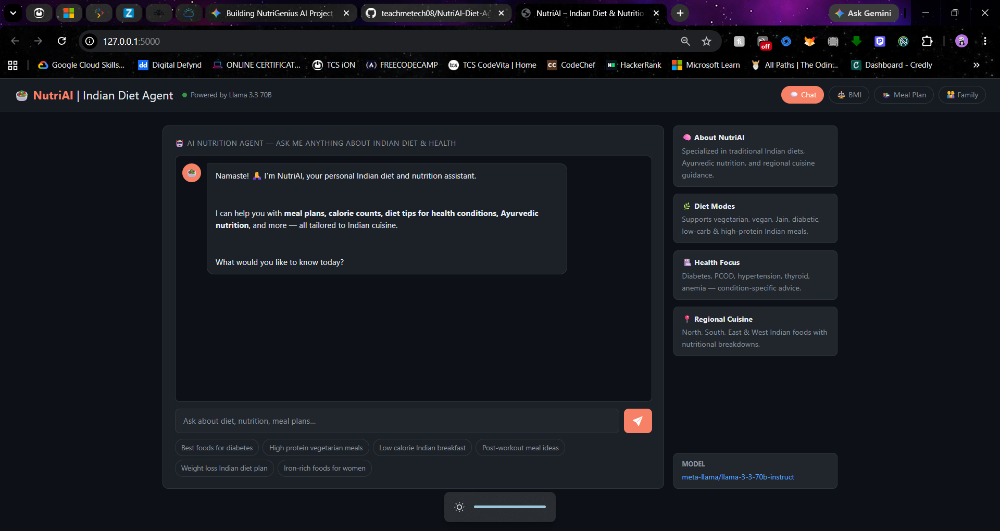
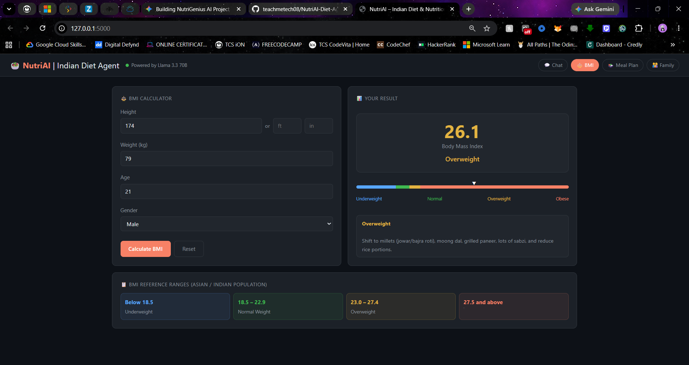
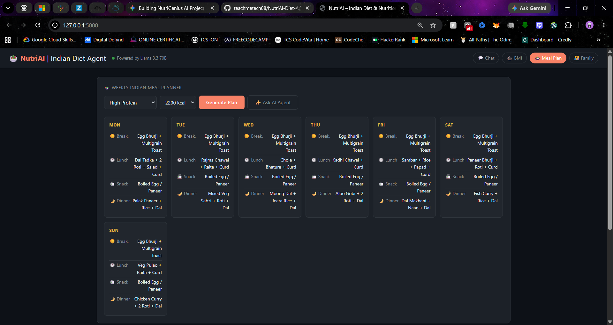
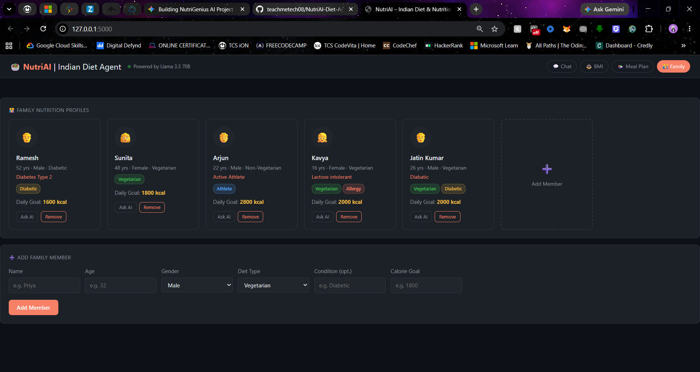
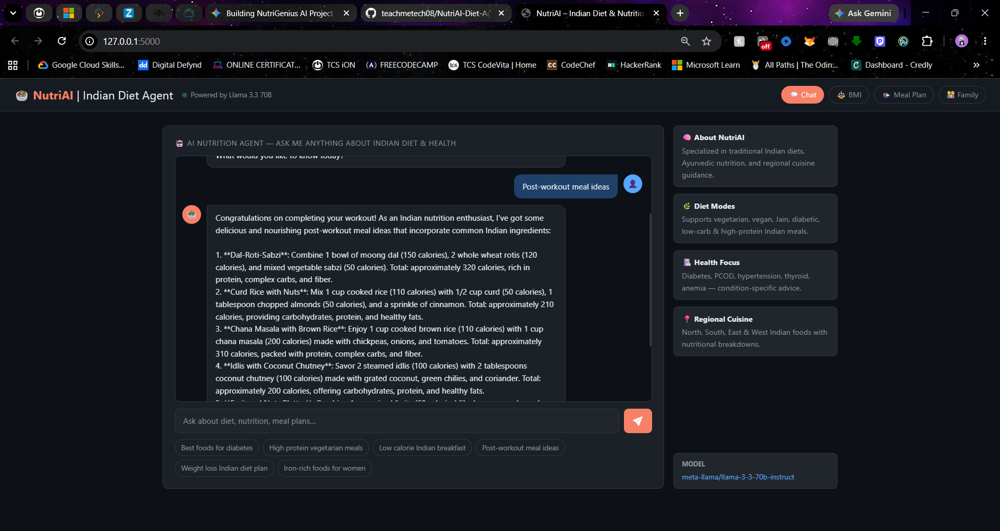

# NutriAI — Multi-Regional Full-Stack Indian Diet & Health Agent

NutriAI is a responsive, full-stack health web application that serves tailored dietary blueprints, caloric breakdowns, and regional Indian meal plans.

## 🛠️ Tech Stack
- **Frontend:** HTML5, CSS3, JavaScript (ES6+), Marked.js
- **Backend:** Python, Flask
- **LLM Infrastructure:** IBM watsonx.ai Runtime
- **Model Engine:** Meta Llama 3.3 70B Instruct

## ⚡ Architecture Flow
User UI Input ➔ Flask API Server ➔ `ibm-watsonx-ai` SDK ➔ IBM Cloud Sydney Cluster (`au-syd`) ➔ Llama 3.3 70B Inference ➔ Structured Markdown UI Stream.

## 📸 Application Previews

### 🤖 AI Nutrition Agent Chat

### 📊 South Asian BMI Diagnostic Tool

### 🗓️ Weekly Regional Indian Meal Planner

### 👥 Multi-Profile Family Tracking

### 💬 Tailored Nutritional Feedback Stream
